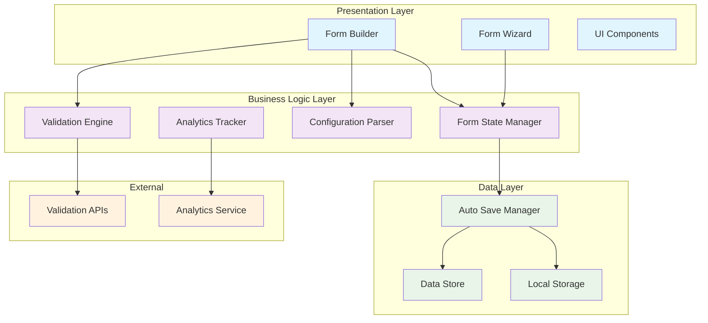
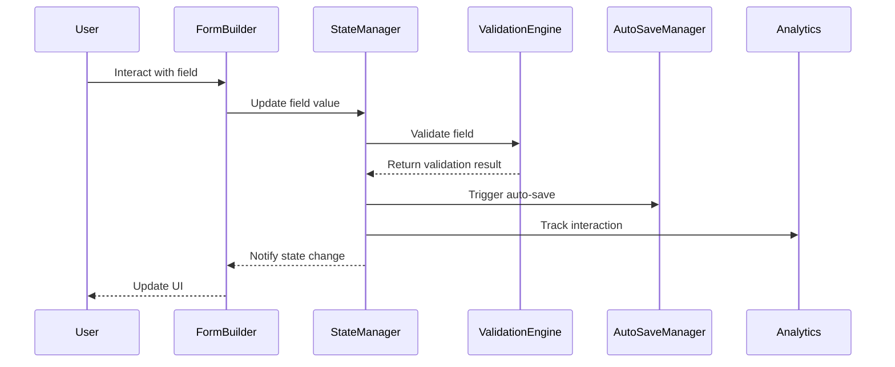

# Form Management System Design

## Overview

The Form Management System is a comprehensive solution for creating, managing, and processing complex forms in web applications. The system provides dynamic form generation from JSON configurations, advanced validation with both synchronous and asynchronous rules, automatic data persistence, multi-step form navigation, and detailed analytics tracking.

The architecture follows a modular design with clear separation of concerns, enabling each component to be developed, tested, and maintained independently while working together seamlessly. The system prioritizes user experience through accessibility compliance, performance optimization, and robust error handling.

## Architecture

The system follows a layered architecture with the following key components:



### Component Responsibilities

- **Form Builder**: Renders dynamic forms from configuration objects
- **Form Wizard**: Manages multi-step form navigation and progress
- **Validation Engine**: Processes validation rules and provides feedback
- **Form State Manager**: Maintains centralized form state and change tracking
- **Configuration Parser**: Parses and validates JSON form configurations
- **Auto Save Manager**: Handles automatic data persistence and recovery
- **Analytics Tracker**: Collects form interaction metrics and completion data

## Components and Interfaces

### Form Builder

The Form Builder is responsible for dynamically generating form UI from configuration objects.

```typescript
interface FormBuilder {
  render(config: FormConfiguration): FormElement;
  updateField(fieldId: string, updates: FieldUpdates): void;
  applyConditionalLogic(conditions: ConditionalRule[]): void;
  setFieldVisibility(fieldId: string, visible: boolean): void;
}

interface FormConfiguration {
  id: string;
  title: string;
  description?: string;
  fields: FieldDescriptor[];
  layout: LayoutConfiguration;
  validation: ValidationConfiguration;
  conditionalLogic?: ConditionalRule[];
}

interface FieldDescriptor {
  id: string;
  type: FieldType;
  label: string;
  placeholder?: string;
  required: boolean;
  validation: ValidationRule[];
  dependencies?: string[];
  styling?: FieldStyling;
}
```

### Validation Engine

The Validation Engine processes both synchronous and asynchronous validation rules.

```typescript
interface ValidationEngine {
  validateField(fieldId: string, value: any, context: FormState): ValidationResult;
  validateForm(formState: FormState): Promise<FormValidationResult>;
  addCustomRule(name: string, rule: ValidationFunction): void;
  executeAsyncValidation(fieldId: string, value: any): Promise<ValidationResult>;
}

interface ValidationResult {
  isValid: boolean;
  errors: ValidationError[];
  warnings?: ValidationWarning[];
}

interface ValidationRule {
  type: 'required' | 'email' | 'minLength' | 'maxLength' | 'pattern' | 'custom' | 'async';
  params?: Record<string, any>;
  message: string;
  condition?: (formState: FormState) => boolean;
}
```

### Form State Manager

The Form State Manager maintains centralized state and coordinates updates across components.

```typescript
interface FormStateManager {
  getState(): FormState;
  updateField(fieldId: string, value: any): void;
  setValidationState(fieldId: string, result: ValidationResult): void;
  resetForm(): void;
  subscribeToChanges(callback: StateChangeCallback): Subscription;
  getFieldValue(fieldId: string): any;
  isFormValid(): boolean;
}

interface FormState {
  values: Record<string, any>;
  validation: Record<string, ValidationResult>;
  touched: Record<string, boolean>;
  dirty: Record<string, boolean>;
  isSubmitting: boolean;
  submitCount: number;
  metadata: FormMetadata;
}
```

### Auto Save Manager

The Auto Save Manager handles automatic data persistence and recovery.

```typescript
interface AutoSaveManager {
  enableAutoSave(formId: string, interval: number): void;
  saveNow(formId: string, data: FormState): Promise<void>;
  loadDraft(formId: string): Promise<FormState | null>;
  clearDraft(formId: string): Promise<void>;
  setStorageQuota(maxSize: number): void;
  onSaveStatusChange(callback: SaveStatusCallback): Subscription;
}

interface SaveStatus {
  status: 'idle' | 'saving' | 'saved' | 'error';
  lastSaved?: Date;
  error?: Error;
  queuedSaves: number;
}
```

### Form Wizard

The Form Wizard manages multi-step form navigation and progress tracking.

```typescript
interface FormWizard {
  goToStep(stepIndex: number): Promise<boolean>;
  nextStep(): Promise<boolean>;
  previousStep(): void;
  getCurrentStep(): WizardStep;
  getProgress(): WizardProgress;
  canNavigateToStep(stepIndex: number): boolean;
  setStepValidation(stepIndex: number, isValid: boolean): void;
}

interface WizardStep {
  index: number;
  id: string;
  title: string;
  fields: string[];
  isComplete: boolean;
  isValid: boolean;
  conditionalNext?: (formState: FormState) => number;
}
```

## Data Models

### Core Data Structures

```typescript
// Form Configuration Schema
interface FormConfiguration {
  id: string;
  version: string;
  title: string;
  description?: string;
  steps?: WizardStep[];
  fields: FieldDescriptor[];
  layout: LayoutConfiguration;
  validation: ValidationConfiguration;
  autoSave?: AutoSaveConfiguration;
  analytics?: AnalyticsConfiguration;
  accessibility?: AccessibilityConfiguration;
}

// Field Type Definitions
type FieldType = 
  | 'text' 
  | 'number' 
  | 'email' 
  | 'password' 
  | 'select' 
  | 'checkbox' 
  | 'radio' 
  | 'textarea' 
  | 'file' 
  | 'date' 
  | 'time' 
  | 'datetime-local';

// Validation Configuration
interface ValidationConfiguration {
  validateOnChange: boolean;
  validateOnBlur: boolean;
  showErrorsOnSubmit: boolean;
  debounceMs: number;
  customRules: Record<string, ValidationFunction>;
}

// Layout Configuration
interface LayoutConfiguration {
  type: 'single-column' | 'two-column' | 'grid' | 'custom';
  spacing: 'compact' | 'normal' | 'relaxed';
  fieldGroups?: FieldGroup[];
  responsive: ResponsiveConfiguration;
}

// Analytics Data Models
interface FormAnalytics {
  formId: string;
  sessionId: string;
  startTime: Date;
  endTime?: Date;
  completionStatus: 'completed' | 'abandoned' | 'in-progress';
  fieldInteractions: FieldInteraction[];
  stepMetrics?: StepMetrics[];
  abandonmentPoint?: string;
}

interface FieldInteraction {
  fieldId: string;
  eventType: 'focus' | 'blur' | 'change' | 'error';
  timestamp: Date;
  value?: any;
  timeSpent?: number;
}

// Storage Models
interface DraftData {
  formId: string;
  userId?: string;
  sessionId: string;
  data: FormState;
  createdAt: Date;
  updatedAt: Date;
  expiresAt: Date;
  compressed: boolean;
}
```

### Data Flow Architecture



The data flow ensures that all components stay synchronized while maintaining clear boundaries and responsibilities. The State Manager acts as the central coordinator, ensuring that validation, auto-save, and analytics all receive appropriate notifications without tight coupling between components.

## Correctness Properties

*A property is a characteristic or behavior that should hold true across all valid executions of a system-essentially, a formal statement about what the system should do. Properties serve as the bridge between human-readable specifications and machine-verifiable correctness guarantees.*

### Property 1: Complete Form Rendering

*For any* valid Form_Configuration, the Form_Builder should render a complete form containing all specified fields with their correct types and properties.

**Validates: Requirements 1.1, 1.2**

### Property 2: Conditional Field Visibility

*For any* form with field dependencies, when a dependent field's value changes, all fields that depend on it should update their visibility according to the dependency rules.

**Validates: Requirements 1.3, 1.5**

### Property 3: Configuration Styling Application

*For any* Form_Configuration with styling and layout options, the rendered form should apply all specified styling and layout configurations to the appropriate elements.

**Validates: Requirements 1.4**

### Property 4: Validation Execution

*For any* form field with validation rules, validation should execute on blur, change, and submit events, returning appropriate validation results for both synchronous and asynchronous rules.

**Validates: Requirements 2.1, 2.2, 2.3, 2.4**

### Property 5: Custom Validation Context

*For any* custom validation function, it should receive access to the complete current form state when executed.

**Validates: Requirements 2.5**

### Property 6: Validation Feedback Display

*For any* validation result (success or failure), the system should display appropriate visual feedback with configurable positioning and styling.

**Validates: Requirements 2.6, 2.7**

### Property 7: Auto-Save Triggering

*For any* form with auto-save enabled, data should be automatically saved at configured intervals and on field blur events.

**Validates: Requirements 3.1, 3.3**

### Property 8: Draft Data Recovery

*For any* form with saved draft data, when a user returns to the form, the system should restore all previously saved field values and state.

**Validates: Requirements 3.2**

### Property 9: Offline Save Management

*For any* auto-save operation that fails due to network connectivity, the system should queue the save and retry when connectivity is restored.

**Validates: Requirements 3.4**

### Property 10: Save Status Indication

*For any* auto-save operation, the system should display appropriate visual indicators reflecting the current save status (saving, saved, error).

**Validates: Requirements 3.5**

### Property 11: Draft Cleanup

*For any* form that is successfully submitted, all associated draft data should be cleared from storage.

**Validates: Requirements 3.6**

### Property 12: Storage Quota Management

*For any* storage system approaching quota limits, the Auto_Save_Manager should remove oldest drafts to maintain storage within limits.

**Validates: Requirements 3.7**

### Property 13: Wizard Step Navigation

*For any* multi-step form, users should be able to navigate between steps using next/previous controls, with navigation blocked if the current step is invalid.

**Validates: Requirements 4.1, 4.2**

### Property 14: Step Data Preservation

*For any* multi-step form navigation, all entered data should be preserved when moving between steps.

**Validates: Requirements 4.3**

### Property 15: Progress Indication

*For any* multi-step form, progress indicators should accurately reflect the current step and overall completion status.

**Validates: Requirements 4.4**

### Property 16: Conditional Step Routing

*For any* multi-step form with conditional routing rules, navigation should follow the correct path based on previous answers.

**Validates: Requirements 4.5**

### Property 17: Non-Linear Step Access

*For any* multi-step form, users should be able to jump directly to any previously completed step.

**Validates: Requirements 4.6**

### Property 18: Final Step Submission

*For any* multi-step form on the final step, form submission functionality should be available and functional.

**Validates: Requirements 4.7**

### Property 19: Comprehensive Analytics Tracking

*For any* form interaction (start, field focus/blur/change, abandonment), the Analytics_Tracker should record the appropriate event data with timestamps and context.

**Validates: Requirements 5.1, 5.2, 5.3**

### Property 20: Time Measurement Tracking

*For any* form step or field interaction, the system should accurately measure and record time spent.

**Validates: Requirements 5.4**

### Property 21: Analytics Calculations

*For any* set of form analytics data, the system should correctly calculate completion rates and identify bottleneck fields.

**Validates: Requirements 5.5**

### Property 22: Analytics Reporting

*For any* collected analytics data, it should be accessible through the reporting interface in aggregated form.

**Validates: Requirements 5.6**

### Property 23: Privacy Mode Anonymization

*For any* analytics data collected when privacy mode is enabled, all personally identifiable information should be anonymized.

**Validates: Requirements 5.7**

### Property 24: Configuration Parsing

*For any* valid Form_Configuration JSON, the Configuration_Parser should successfully parse it into the correct internal form structure.

**Validates: Requirements 6.1**

### Property 25: Configuration Validation

*For any* invalid Form_Configuration, the Configuration_Parser should return descriptive validation errors identifying the specific issues.

**Validates: Requirements 6.2**

### Property 26: Complex Structure Parsing

*For any* Form_Configuration with nested field groups and complex layouts, the parser should correctly handle the nested structure.

**Validates: Requirements 6.3**

### Property 27: Configuration Formatting

*For any* internal Form_Configuration object, the Pretty_Printer should format it into valid JSON.

**Validates: Requirements 6.4**

### Property 28: Configuration Round-Trip

*For any* valid Form_Configuration object, parsing then printing then parsing should produce an equivalent object.

**Validates: Requirements 6.5**

### Property 29: Comprehensive State Management

*For any* form field value or validation state change, the Form_State_Manager should maintain accurate current values and validation status for all fields and the overall form.

**Validates: Requirements 7.1, 7.2**

### Property 30: Cascading State Updates

*For any* field value change, the Form_State_Manager should update all dependent field visibility and validation states accordingly.

**Validates: Requirements 7.3**

### Property 31: Programmatic State Control

*For any* programmatic state manipulation through Form_State_Manager methods, field values and validation states should update correctly.

**Validates: Requirements 7.4**

### Property 32: Form Reset Functionality

*For any* form reset operation, all field data and validation states should be cleared to their initial state.

**Validates: Requirements 7.5**

### Property 33: State Change Events

*For any* form state change, appropriate events should be emitted to enable reactive updates.

**Validates: Requirements 7.6**

### Property 34: Accessibility Markup Generation

*For any* generated form, all elements should include proper ARIA labels, descriptions, and semantic HTML structure.

**Validates: Requirements 8.1, 8.6**

### Property 35: Keyboard Navigation Support

*For any* form element, keyboard navigation should work correctly with customizable focus indicators and proper tab order.

**Validates: Requirements 8.2, 8.5**

### Property 36: Screen Reader Error Announcements

*For any* validation error, the system should make appropriate announcements to screen readers.

**Validates: Requirements 8.3**

### Property 37: High Contrast Mode Support

*For any* form in high contrast mode, all elements should display with appropriate contrast and visibility.

**Validates: Requirements 8.4**

### Property 38: Performance Optimizations

*For any* large form, the system should implement virtual scrolling, lazy loading, and debouncing to maintain responsive performance.

**Validates: Requirements 9.1, 9.2, 9.3**

### Property 39: Data Compression

*For any* draft data saved to storage, the Auto_Save_Manager should compress the data to minimize storage usage.

**Validates: Requirements 9.5**

### Property 40: Progressive Enhancement

*For any* form, core functionality should work without JavaScript through progressive enhancement.

**Validates: Requirements 9.6**

## Error Handling

The Form Management System implements comprehensive error handling across all components to ensure graceful degradation and user-friendly error recovery.

### Validation Error Handling

- **Field-Level Errors**: Individual field validation errors are captured and displayed with contextual messaging
- **Form-Level Errors**: Cross-field validation errors are presented at the form level with clear guidance
- **Async Validation Errors**: Network failures during async validation are handled with retry mechanisms and fallback messaging
- **Custom Validation Errors**: Custom validation functions can throw structured errors that are properly formatted for display

### Auto-Save Error Handling

- **Storage Quota Exceeded**: Automatic cleanup of oldest drafts with user notification
- **Network Failures**: Queuing of failed saves with automatic retry when connectivity is restored
- **Corruption Detection**: Validation of saved data integrity with recovery from backup copies
- **Permission Errors**: Graceful handling of storage permission issues with alternative storage strategies

### Configuration Error Handling

- **Schema Validation**: Comprehensive validation of form configurations with detailed error messages
- **Missing Dependencies**: Detection and reporting of missing field dependencies or validation rules
- **Circular Dependencies**: Prevention and reporting of circular field dependencies
- **Version Compatibility**: Handling of configuration version mismatches with migration support

### Performance Error Handling

- **Memory Pressure**: Automatic cleanup of unused components and data when memory is constrained
- **Rendering Failures**: Fallback rendering strategies for complex form layouts
- **Timeout Handling**: Graceful handling of slow validation or save operations with user feedback

## Testing Strategy

The Form Management System employs a dual testing approach combining unit tests for specific scenarios with property-based tests for comprehensive coverage.

### Unit Testing Approach

Unit tests focus on specific examples, edge cases, and integration points:

- **Component Integration**: Testing interactions between Form Builder, State Manager, and Validation Engine
- **Edge Cases**: Empty forms, maximum field counts, boundary value validation
- **Error Conditions**: Network failures, storage quota exceeded, invalid configurations
- **User Workflows**: Complete form submission flows, multi-step navigation scenarios
- **Accessibility**: Screen reader compatibility, keyboard navigation paths

### Property-Based Testing Configuration

Property-based tests verify universal properties across all inputs using **fast-check** for JavaScript/TypeScript:

- **Test Configuration**: Minimum 100 iterations per property test to ensure comprehensive input coverage
- **Generator Strategy**: Custom generators for Form_Configuration objects, field values, and user interactions
- **Shrinking**: Automatic reduction of failing test cases to minimal reproducible examples
- **Seed Management**: Reproducible test runs with configurable random seeds

Each property test references its corresponding design document property:

```typescript
// Example property test structure
describe('Form Management System Properties', () => {
  it('Property 1: Complete Form Rendering', () => {
    // Feature: form-management-system, Property 1: Complete Form Rendering
    fc.assert(fc.property(
      formConfigurationArbitrary(),
      (config) => {
        const form = formBuilder.render(config);
        return config.fields.every(field => 
          form.hasField(field.id) && 
          form.getFieldType(field.id) === field.type
        );
      }
    ), { numRuns: 100 });
  });
});
```

### Test Coverage Requirements

- **Property Tests**: All 40 correctness properties must be implemented as property-based tests
- **Unit Tests**: Minimum 90% code coverage for critical paths and error handling
- **Integration Tests**: End-to-end workflows covering complete user journeys
- **Performance Tests**: Load testing for large forms and high-frequency auto-save operations
- **Accessibility Tests**: Automated accessibility testing with axe-core integration

The testing strategy ensures both functional correctness through property verification and practical usability through targeted unit and integration testing.